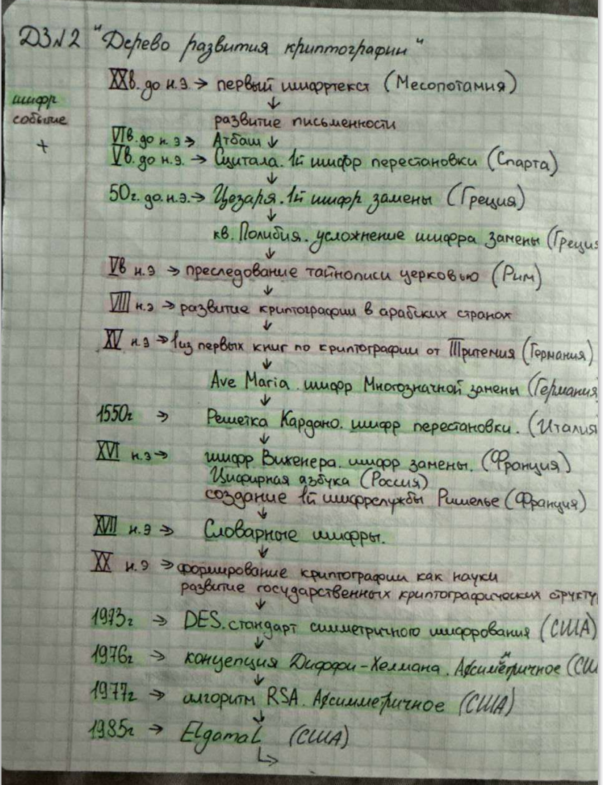
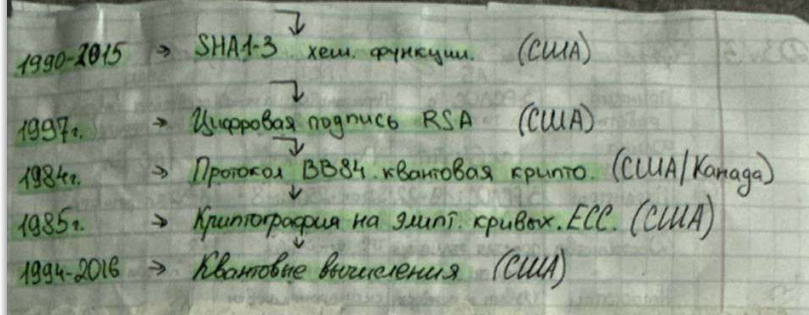

[1.    История развития криптографии. Закон Керкгоффса.](#custom-anchor-name1)

[2.    Концепция избыточной информации К.Шеннона. Совершенный шифр. Шифр Вернама.](#custom-anchor-name2)

[3.    Задачи и проблемы современной криптографии.](#custom-anchor-name3)

[4.    Задачи криптографии. Конфиденциальность. Криптографические алгоритмы.](#custom-anchor-name4)

[5.    Атаки на шифры. Криптографическая стойкость.](#custom-anchor-name5)

[6.    Симметричные и асимметричные криптосистемы.](#custom-anchor-name6)

[7.    Задачи криптографии. Целостность. Имитостойкость.](#custom-anchor-name7)

[8.    Задачи криптографии. Аутентификация. Протоколы идентификации.](#custom-anchor-name8)

[9.    Задачи криптографии. Невозможность отказа от авторства. Цифровая подпись.](#custom-anchor-name9)

[10.   Цифровая подпись. Сертификация открытых ключей.](#custom-anchor-name10)

[11.   Протоколы распределения ключей. Схемы разделения секрета. Атаки на протоколы распределения ключей.](#custom-anchor-name11)

[12.   Классификация шифров по различным признакам.](#custom-anchor-name12)

[13.   Шифры перестановки. Криптоанализ шифров перестановки.](#custom-anchor-name13)

[14.   Шифры замены. Криптоанализ поточного шифра простой замены.](#custom-anchor-name14)

[15.   Шифры гаммирования. Криптоанализ шифра Виженера.](#custom-anchor-name15)

[16.   Требования к гамме. Ошибки при использовании шифров гаммирования.](#custom-anchor-name16)

[17.   Блочные системы шифрования. Конструкции Фейстеля.](#custom-anchor-name17)

[18.   Блочные системы шифрования. Стандарт шифрования данных ГОСТ 28147-89.](#custom-anchor-name18)

[19.   Блочные системы шифрования. Стандарт шифрования данных DES.](#custom-anchor-name19)

[20.   Стандарт шифрования данных ГОСТ 28147-89. Режимы использования.](#custom-anchor-name20)

[21.   Стандарт шифрования данных ГОСТ Р 34.12-2015. Алгоритмы шифрования.](#custom-anchor-name21)

[22.   Стандарт шифрования данных ГОСТ Р 34.13-2015. Режимы блочных шифров.](#custom-anchor-name22)

[23.   Стандарт шифрования данных DES. Режимы использования.](#custom-anchor-name23)

[24.   Стандарт шифрования данных АES. Режимы использования.](#custom-anchor-name24)

[25.   Системы шифрования с открытыми ключами.](#custom-anchor-name25)

[26.   Режимы использования систем с открытым ключом.](#custom-anchor-name26)

[27.   Открытое распределение ключей. Схема Диффи-Хеллмана.](#custom-anchor-name27)

[28.   Криптосистема RSA. Криптоанализ шифра RSA.](#custom-anchor-name28)

[29.   Схема шифрования Эль-Гамаля. Криптоанализ.](#custom-anchor-name29)

[30.   Криптосистемы без передачи ключа. Организация секретной связи.](#custom-anchor-name30)

[31.   Криптография на эллиптических кривых.](#custom-anchor-name31)

[32.   Криптографические хеш-функции. Ключевые и бесключевые функции хеширования, их свойства и назначение.](#custom-anchor-name32)

[33.   Режимы шифрования блочных шифров. Электронная кодовая книга.](#custom-anchor-name33)

[34.   Режимы шифрования блочных шифров. Режим сцепления блоков.](#custom-anchor-name34)

[35.   Режимы шифрования блочных шифров. Режим обратной связи по шифртексту.](#custom-anchor-name35)

[36.   Режимы шифрования блочных шифров. Режим обратной связи по выходу.](#custom-anchor-name36)

[37.   Электронная цифровая подпись. Криптографические протоколы.](#custom-anchor-name37)

[38.   Протокол цифровой подписи по алгоритму RSA.](#custom-anchor-name38)

[39.   Цифровая подпись по алгоритму Эль-Гамаля ЕGSА.](#custom-anchor-name39)

[40.   Протокол цифровой подписи по стандарту DSS.](#custom-anchor-name40)

[41.   Стандарт цифровой подписи ГОСТ Р34.10-94.](#custom-anchor-name41)

[42.   Стандарт цифровой подписи ГОСТ Р34.10-2001.](#custom-anchor-name42)

[43.   Стандарт цифровой подписи ГОСТ Р34.10-2012.](#custom-anchor-name43)

[44.   Электронная цифровая подпись. Требования к хеш-функции.](#custom-anchor-name44)

[45.   Электронная цифровая подпись. Функция хеширования по ГОСТ Р 34.11-94.](#custom-anchor-name45)

[46.   Электронная цифровая подпись. Функция хеширования по ГОСТ Р 34.11-2012.](#custom-anchor-name46)

[47.   Электронная цифровая подпись. Алгоритмы хеширования MDx и SHA-1.](#custom-anchor-name47)

[48.   Криптоанализ односторонних хеш-функций.](#custom-anchor-name48)

[49.   Квантовая криптография.](#custom-anchor-name49)

---
### 1. История развития криптографии. Закон Керкгоффса.

> **Криптография** – наука о способах преобразования информации с целью ее защиты от несанкционированных пользователей.

Слово «криптография» образовано из двух греческих слов: *kryptos* – тайный, скрытый  и   *graphό* -  пишу.

> **Криптоанализ** – наука о методах и способах вскрытия шифров.

> **Криптология** (от греческих корней kryptos - скрытно» и logos - «слово, понятие учение»). 
> Криптология = криптография + криптоанализ 

>**Дешифрование** (deciphering) — восстановление исходного сообщения без знания ключа или алгоритма (криптоанализ, «взлом»).

>**Расшифрование** (decryption) — восстановление исходного сообщения с помощью законного ключа и известного алгоритма (легальный процесс).

Устная речь была первой лабораторией для криптографии. Естественное человеческое стремление скрыть информацию от чужаков, передать ее только своим, обойти запреты привело к спонтанному созданию примитивных криптографических систем.

P.S. 
**Белазо**
Буква открытого текста определяет строку таблицы.

Буква ключа определяет столбец таблицы.

На пересечении — буква шифртекста.

**Тритемия**
Индекс буквы открытого текста определяет строку таблицы.

Буква исходного текста определяет столбец таблицы.

На пересечении — буква шифртекста.

---
### 2. Концепция избыточной информации К.Шеннона. Совершенный шифр. Шифр Вернама.

Центральной в работах Шеннона является **концепция избыточной информации**, содержащейся в текстовых сообщениях. 

> **Избыточность** означает, что в сообщении содержится больше символов, чем в действительности требуется для передачи содержащейся в нем информации. Если шифрование «стирает» избыточность, то восстановить текст по криптограмме криптоаналитику становится принципиально невозможно. P.S. **Избыточность** нужна для проверки целостности и размытии гистограмм.

Разработанные Шенноном концепции *теоретической* и *практической* секретности позволяют количественно оценивать криптографические качества шифров и пытаться строить идеальные или **совершенные шифры**.

> **Совершенные шифры** — это идеальные шифры, криптографические качества которых можно количественно оценить с помощью разработанных Шенноном концепций теоретической и практической секретности.

> **Шифр Вернама** (Vernam cipher), или **«одноразовый блокнот»** - это система шифрования, изобретенная Гилбертом Вернамом, которая использует операцию исключающее ИЛИ (XOR) для побитового комбинирования текста с ключом и является примером системы с абсолютной криптографической стойкостью, доказанной Клодом Шенноном, при условии использования одноразового случайного ключа такой же длины, как сообщение.

